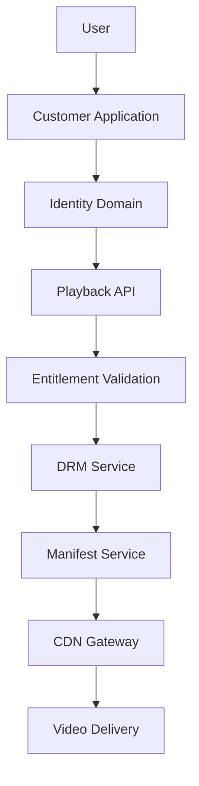

# Technical Playbook: Investigating a Playback Failure
**Version 1.0**
**Audience:** Engineers, Site Reliability Engineers (SREs), Incident responders, Platform teams

**Owner:** Hector Adama

**Last Updated:** June 2026

*NOTE: EmuTV is a fictional streaming platform used as an example for this document.*

## Purpose
This playbook provides a structured approach for investigating playback failures within the EmuTV platform.

The objective is not to provide exhaustive troubleshooting procedures for every failure mode. Instead, this guide helps engineers:

 - Identify likely failure domains
 - Reduce time-to-diagnosis
 - Escalate issues appropriately
 - Understand system dependencies
 - Restore service quickly

## Scope
Use this playbook when users report:

 - Videos fail to start
 - Playback sessions cannot be created
 - Infinite loading indicators
 - Playback authorisation errors
 - Streaming failures after playback begins

Do not use this playbook for:

 - Account login issues
 - Subscription purchase failures
 - Content publishing problems
 - Recommendation issues

## Understanding the Playback Path
Before troubleshooting, understand the request path.

A failure anywhere on this path can prevent successful playback.

## Incident Classification
Describe the scope of the impact.

### Severity Assessment
#### SEV-1
Symptoms:

 - Playback unavailable globally
 - All titles affected
 - Revenue-impacting outage

Examples:

 - Playback API unavailable
 - CDN outage
 - Authentication failure preventing playback authorisation

Immediate escalation is required.

#### SEV-2
Symptoms:

 - Significant customer impact
 - Regional failures
 - Specific device ecosystems affected

Examples:

 - Smart TV playback failures
 - Regional CDN routing issues

#### SEV-3
Symptoms:

 - Limited impact
 - Isolated title failures
 - Single workflow degradation

Examples:

 - Incorrect content configuration
 - Metadata inconsistencies

## Initial Triage Checklist
Before investigating specific systems, answer the following:

### What is failing?
Can users:

 - open the application?
 - browse content?
 - select content?
 - start playback?

### Who is affected?
Determine:

 - Geographic region
 - Device platform
 - Subscription tier
 - Content type

Examples:

 - Only Android users
 - Only live content
 - Only premium subscribers

### When did it start?
Identify:

 - Deployment timing
 - Configuration changes
 - Infrastructure incidents

Correlate failures with recent changes whenever possible.

## Failure Isolation Workflow
Never start with assumptions. Use the following sequence to begin working through the issue:

### Step 1: Verify Identity Domain
Playback depends on successful user authentication.

Relevant Services:

 - Identity API
 - Session Service
 - Token Service

Questions:

 - Are tokens being validated?
 - Are sessions being created?
 - Has authentication latency increased?

Indicators:

 - Large increase in authentication failures
 - Token validation errors
 - Expired session anomalies

If authentication fails, stop. Playback investigation should shift to the Identity Platform team instead.

### Step 2: Verify Entitlement Validation
Users must possess valid viewing entitlements to stream video content.

Relevant Domain:
Billing

Relevant Events:

 - SubscriptionActivated
 - SubscriptionExpired

Questions:

 - Are subscriptions being recognised?
 - Are entitlements resolving correctly?
 - Has Billing published recent events successfully?

Indicators:

 - Users can browse but cannot watch content.
 - Authorisation failures occur despite active subscriptions.

If entitlement validation fails, escalate to the Billing Engineering team.

### Step 3: Verify Playback API
The Playback API must be healthy and available to create playback sessions.
 
Relevant Domain:
Billing

Questions:

 - Is the API healthy?
 - Are requests timing out?
 - Has latency increased?
 - Has there been any recent updates to the API?

Indicators:

 - Playback never starts.
 - Session creation fails.

If you verify a problem with the Playback API, it must be escalated to a Critical issue and further investigation must begin immediately.

Key Metrics:

 - Request volume
 - Error rate
 - Latency
 - Availability
 
### Step 4: Verify DRM Service
The Digital Rights Management (DRM) Service protects licensed content.

Questions:

 - Are license requirements succeeding?
 - Have DRM certificates expired?
 - Are failures platform-specific?

Indicators:

 - Playback starts then immediately fails.
 - Device-specific playback errors.

Examples:

 - Only Smart TV devices affected.
 - Only iOS devices affected.

These patterns often indicate DRM issues.

### Step 5: Verify Manifest Generation
The Manifest Service generates streaming manifests.

Questions:

 - Are manifests being generated?
 - Are playback tokens valid?
 - Are generated URLs accessible?

Indicators:

 - Video remains in a loading state.
 - Playback initialisation fails.

Check:

 - Manifest generation logs
 - Playback session records
 - URL signing workflows

### Step 6: Verify CDN Delivery
Most video traffic bypasses core application services.

Questions:

 - Are edge nodes healthy?
 - Are cache invalidation events succeeding?
 - Is regional routing functioning?

Indicators:

 - Playback succeeds in one region, but not in another
 - Intermittent buffering
 - Regional outages

Check:

 - CDN health dashboards
 - Edge node metrics
 - Regional availability reports

## Event Validation
The platform uses event-driven communication to pass information between domains.

Relevant Events:

 - SubscriptionActivated
 - PlaybackStarted
 - PlaybackCompleted

Verify:

 - Events are being published
 - Events are being consumed
 - Lag remains within acceptable values

## Dependency Analysis
The Playback Domain depends on:
```
Playback API
|
├── Identity API
├── Entitlement Service
├── DRM Service
└── CDN Gateway
```

Failure in any dependency can appear as a playback problem.

Avoid treating playback failures as isolated playback issues.

Always investigate dependencies.

## Common Failure Patterns
### Pattern 1: Authentication Failure
Symptoms:

 - Users cannot start playback
 - Authorisation errors increase

Likely Cause:
Identity Domain degradation

Owner:
Identity Platform Team

### Pattern 2: Subscription Recognition Failure
Symptoms:

 - Active subscribers denied access

Likely Cause:
Billing entitlement issue

Owner:
Billing Engineering Team

### Pattern 3: DRM Failure
Symptoms:

 - Playback starts but immediately fails
 - Device-specific impacts

Likely Cause:
DRM license validation

Owner:
Playback Engineering Team

### Pattern 4: CDN Failure
Symptoms:

 - Regional playback issues
 - High buffering rates

Likely Cause:
Edge delivery problem

Owner:
Playback Engineering Team

### Pattern 5: Manifest Generation Failure
Symptoms:

 - Infinite loading indicators
 - Playback initialisation failures

Likely Cause:
Manifest Service degradation

Owner:
Playback Engineering Team

## Escalation Matrix
|System|Primary Team|
|--|--|
|Identity API|Identity Platform|
|Billing Events|Billing Engineering|
|Playback API|Playback Engineering|
|DRM Service|Playback Engineering|
|CDN Gateway|Playback Engineering|
|Analytics Pipeline|Analytics Engineering|

## Communications Guidance
When reporting findings, it is important to be as clear and detailed as possible.

Avoid saying:
>"Playback is broken."

Instead, provide useful details:
>"The Playback API is healthy and identity validation is succeeding. Manifest generation is also succeeding. Regional CDN edge nodes in APAC are returning elevated error rates."

This clearly communicates:

 - Scope
 - Evidence
 - Suspected root cause

Poorly communicating your findings can cause delays in incident response.

## Post-Incident Activities
After resolving an issue:

### Capture the Timeline
You must document:

 - Detection
 - Escalation
 - Mitigation
 - Resolution

Keeping a consistent and regularly updated record of all incidents, details, findings, and resolutions is important. It will make it easier to identify and resolve problems in the future, especially if a problem is recurring and may indicate larger problems.

### Update Runbooks
If new information was discovered:

 - Update troubleshooting procedures
 - Update dependency maps
 - Update known failure modes

### Update Knowledge Assets
Review:

 - Architecture Narrative
 - Engineering Portal
 - Service Catalog
 - Related Runbooks

Knowledge should continually evolve alongside the platform and documentation should be seen as an essential part of the process.

## Quick Reference
Playback Troubleshooting Sequence

 1. Identity
 2. Entitlements
 3. Playback API
 4. DRM Service
 5. Manifest Service
 6. CDN Delivery
 7. Event Validation

Remember, most playback incidents are often dependency failures rather than playback failures themselves.

Always investigate upstream dependencies before assuming the Playback Domain is the root cause.

Understanding relationships between systems is the fastest path to identifying the actual source of failure.
