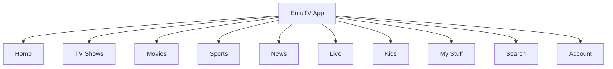
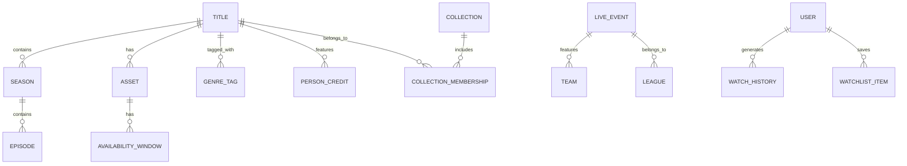
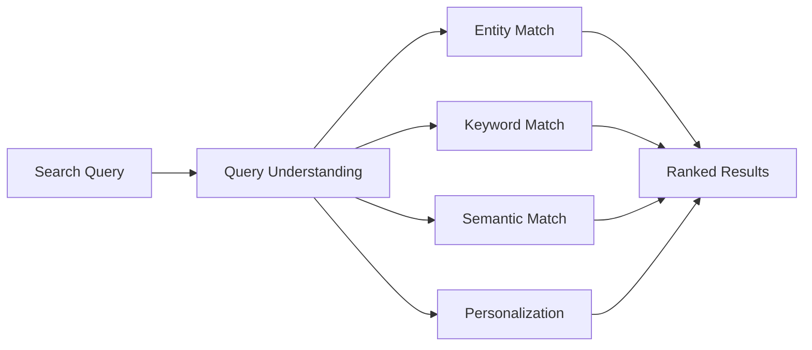

# EmuTV Information Architecture Document
**Version 1.0**

**Audience:** Developers, Platform Teams, Product Managers, Technical Leadership

**Owner:** Hector Adama

*NOTE: EmuTV is a fictional streaming platform used as an example for this document. As this is a sample, it is not exhaustive and has been kept condensed for length, so some sections may appear to be missing steps.*

## 1. Purpose
This document defines the information architecture for EmuTV, a large-scale video streaming platform. The goal is to make a broad catalog of movies, series, live events, sports, news, originals, kids content, and personalised recommendations that is easy to discover, govern, scale, and maintain.

## 2. Information Architecture Goals
Information architecture (IA) in system design bridges the gap between raw data models and a user's mental model. It directly impacts a user's experience with a platform, which can have significant impacts on user satisfaction, user retention, and ultimately revenue. Effective IA involves structuring, labeling, and organising system content so that users intuitively know where they are, what they've found, and what to expect next. 

EmuTV's information architecture must support:

 1. **Fast content discovery**
	 - Users should find something to watch within seconds
	 - Search, browse, recommendations, and editorial surfaces must work together
	 
 2. **Multiple content types**
	 - Movies
	 - Series
	 - Episodes
	 - Live channels
	 - Sports events
	 - News clips
	 - Trailers
	 - Collections
	 - Franchises
	 - Continue Watching items
	 
3. **Personalisation at scale**
	- Home pages, rails, recommendations, and search ranking should adapt to user behaviour, subscription tier, language, region, age profile, and device.
	
4. **Editorial flexibility**
	- Content programmers must be able to create seasonal hubs, campaign pages, sports destinations, franchise collections, and promotional rails without engineering intervention.
	
5. **Metadata consistency**
	- Content must be structured with a reusable taxonomy, controlled vocabulary, localisation rules, rights windows, and availabiilty logic.
	
6. **AI and agent-friendly structure**
	- Content knowledge should be represented in predictable, machine-readable ways to support internal AI search, metadata enrichment, content QA, support agents, and developer tooling.

## 3. Scope
### In Scope

 - Global navigation
 - Content taxonomy
 - Metadata model
 - Search IA
 - Browse IA
 - Personalisation surfaces
 - Live and sports IA
 - Kids profile IA
 - Editorial collections
 - Internal content operations model
 - Knowledge graph approach
 - Growth and scalability considerations

<hr>

### Out of Scope
- Full backend system design
- CDN architecture
- DRM implementation
- Video encoding pipeline details
- Ad decisioning architecture
- Payment processing architecture

## 4. Core User Groups

|Viewer Persona|Expected Behaviour|
|--|--|
|Casual Viewer|Wants quick access to trending movies, popular shows, and recognisable brands.|
|Returning Viewer|Uses Continue Watching, watchlist, personalised recommendations, and new episodes.|
|Sports Viewer|Needs live games, upcoming events, league pages, team pages, replays, highlights, and spoiler-safe navigation.|
|News Viewer|Needs live news, short clips, topic pages, breaking coverage, and local/regional news.|
|Family Viewer|Needs kids-safe navigation, age filtering, parental controls, recognisable characters, and low-friction playback.|
|Franchise Fan|Browses by universe, series, character, genre, release order, or recommended viewing path.|


## 5. Top Level Navigation
The primary navigation should prioritise user mental models over internal organisational structures while taking business priorities into consideration. Top level navigation dictates how users find information, perceive the platform's purpose, and build spatial orientation. 


#### Navigation Principles

 - **Home** is personalised and editorially programmable.
 - **TV Shows** and **Movies** are stable catalog destinations.
 - **Sports**, **News**, and **Live** require time sensitive IA.
 - **Kids** uses separate safety rules and simplified taxonomy.
 - **My Stuff** centralises watchlist, Continue Watching, purchases, reminders, and downloads.
 - **Search** is global and supports content, people, teams, leagues, genres, and channels.

## 6. Content Taxonomy
EmuTV should use a layered taxonomy instead of a flat genre list as it is a far more scalable approach. A layered taxonomy prevents user cognitive overload, supports faceted search, allows for multi-dimensional content categorisation, and adapts easily as the system grows.

 ```mermaid
flowchart TD
	A[Content] --> B[Format]
	A --> C[Genre]
	A --> D[Audience]
	A --> E[Brand / Studio]
	A --> F[Franchise]
	A --> G[Rights / Availability]
	A --> H[Region / Language]
	A --> I[Editorial Collections]
	A --> J[Personalisation Signals]
	B --> B1[Genre]
	B --> B2[Audience]
	B --> B3[Brand / Studio]
	B --> B4[Franchise]
	B --> B5[Rights / Availability]
	B --> B6[Region / Language]
	B --> B7[Editorial Collections]
	C --> C1[Comedy]
	C --> C2[Drama]
	C --> C3[Reality]
	C --> C4[Documentary]
	C --> C5[Action]
	C --> C6[Kids]
	C --> C7[News]
	C --> C8[Sports]
```
### Taxonomy Layers
#### Format
Defines the structural type of the asset. 

Examples:

 - Movie
 - Series
 - Season
 - Episode
 - Live channel
 - Live event
 - Replay
 - Highlight
 - Trailer
 - Bonus clip

<hr>

#### Genre
Defines creative category.

Examples:

 - Comedy
 - Drama
 - Reality
 - True Crime
 - Documentary
 - Sitcom
 - Animated
 - Late Night
 - Sports Talk

<hr>

#### Audience
Defines intended viewer group.

Examples:

 - General
 - Kids 2-5
 - Kids 6-8
 - Kids 9-12
 - Teen
 - Family
 - Mature

<hr>

#### Brand
Groups content by recognisable business or entertainment label.

Examples:

 - EmuTV Originals
 - Universal-style studio catalog
 - News brand
 - Sports brand
 - Kids brand
 - Reality brand
 - Comedy brand

<hr>

#### Franchise
Connects related titles across formats.

Examples:

 - A movie series
 - A shared universe
 - A reality TV franchise
 - A sports league
 - A news program family

<hr>

#### Editorial Collection
A human-curated grouping.

Examples:

 - Trending Now
 - New This Week
 - Award Winners
 - Halloween Collection
 - Premier League Classics
 - Best of Late Night
 - Bingeable Comedies

## 7. Core Content Object Model
A Core Content Object Model (CCOM) translates unstructured business concepts into reusable, structured building blocks. It defines the essential data entities and their relationships, serving as a single source of truth to ensure consistency across the user interface, databases, and APIs.


### Primary Objects
#### Title
The parent content record.

Examples:

-   Movie
-   Series
-   Sports program
-   News program
-   Franchise entry

<hr>

#### Asset

The playable media file or stream.

Examples:

-   Main feature
-   Episode video
-   Trailer
-   Clip
-   Live stream
-   Replay
-   Highlight

<hr>

#### Collection

A curated or algorithmic grouping of content.

Examples:

-   "Because You Watched"
-   "Popular Movies"
-   "Watch the Franchise in Order"
-   "Live Now"
-   "New Episodes"

<hr>

#### Availability Window

Controls whether an item can be watched.

Fields:

-   Start date
-   End date
-   Region
-   Subscription tier
-   Ad eligibility
-   Download eligibility
-   Device restrictions
-   Sports blackout rules

<hr>

#### Person

Actors directors, hosts, commentators, athletes, journalists, and creators.

<hr>

#### Organization

Studios, leagues, teams, networks, production companies, and content brands.

## 8. Metadata Model
A metadata model is a structured framework that defines the "data about data" within a system and makes massive datasets organised, manageable, and searchable. It establishes standardised rules, attributes, and relationships for categorising, describing, and retrieving content. 

### Required Metadata

|Category|Example Fields|
|--|--|
|Identity|Title ID, asset ID, canonical title, alternate titles|
|Content type|Movie, series, episode, live event, clip|
|Descriptive|Synopsis, short description, tagline, keywords|
|Taxonomy|Genre, subgenre, mood, theme, audience|
|Credits|Cast, creators, hosts, athletes, commentators|
|Availability|Region, tier, rights window, blackout status|
|Playback|Duration, video quality, audio formats, captions|
|Localization|Language, subtitles, dubbing, translated metadata|
|Safety|Rating, advisories, kids eligibility|
|Discovery|Search keywords, related titles, franchise links|
|Personalization|Similarity vectors, popularity signals, completion rates|


## 9. Search IA
A search system is the design of interface components, search algorithms, and metadata schemas that allow users to query a system and find specific content. In good system design, it is one of the foundational systems co-designed alongside navigation, labeling, and organisation. EmuTV's search should support both explicit lookup and exploratory discovery.

### Search Query Types

|Query Type|Example|Expected Result|
|--|--|--|
|Title|"The Office"|Exact title match|
|Person|"Tina Fey"|Person page + related titles|
|Genre|"comedies"|Genre browse results|
|Sports team|"Arsenal"|Team page, live events, replays|
|League|"Premier League"|League hub|
|Channel|"NBC News"|Live channel and clips|
|Natural language|"funny shows under 30 minutes"|Filtered recommendations



## 10. AI-Friendly IA
To support AI-assisted workflows, the IA should include structured, retrievable knowledge that large language models (LLMs) and AI agents can easily navigate, process, and act upon.  You should take extra steps to minimise issues such as hallucinations by enforcing rigid tag sets and explicitly defining the relationships between pages, articles, and other content. AI struggles with ambiguity and relies heavily on context engineering, so you should also optimise for semantic clarity and context by removing synonyms and jargon. *Semantic clarity* is the exact, unambiguous definition of concepts and data, preventing miscommunication between machines, databases, and users.

### AI-Ready Documentation Patterns

-   Canonical IDs for every content object
-   Machine-readable metadata
-   Controlled vocabulary
-   Entity relationship graphs
-   Clear ownership fields
-   Versioned taxonomy
-   Source of truth documentation
-   Content lifecycle states
-   API-readable collection definitions

## 11. Example Site Map

```mermaid
flowchart TD
    A[EmuTV] --> B[Home]
    A --> C[TV Shows]
    A --> D[Movies]
    A --> E[Sports]
    A --> F[News]
    A --> G[Live]
    A --> H[Kids]
    A --> I[My Stuff]
    A --> J[Search]

    C --> C1[All Shows]
    C --> C2[Genres]
    C --> C3[Networks]
    C --> C4[Originals]
    C --> C5[New Episodes]

    D --> D1[All Movies]
    D --> D2[Genres]
    D --> D3[Franchises]
    D --> D4[New Releases]
    D --> D5[Leaving Soon]

    E --> E1[Live Sports]
    E --> E2[Leagues]
    E --> E3[Teams]
    E --> E4[Replays]
    E --> E5[Highlights]

    F --> F1[Live News]
    F --> F2[Topics]
    F --> F3[Local]
    F --> F4[Shows]
    F --> F5[Clips]

    I --> I1[Watchlist]
    I --> I2[Continue Watching]
    I --> I3[Downloads]
    I --> I4[Reminders]
```



## 12. Scalability Considerations

### Catalog Growth

As the catalog expands, EmuTV should move from manually managed tags to a hybrid model:

-   Human-governed taxonomy
-   Machine learning (ML)-assisted tagging
-   Automated metadata validation
-   Knowledge graph relationship inference
-   Editorial override controls

<hr>

### Regional Expansion

The IA must support:

-   Region-specific availability
-   Localised metadata
-   Local editorial collections
-   Regional compliance
-   Multiple currencies and plans
-   Regional sports rights
-   Local news hubs

<hr>

### Live Event Scaling

Live sports events and breaking news coverage can introduce traffic spikes. IA should support:

-   Pre-event landing pages
-   Queueable reminders
-   Live status transitions
-   Dynamic hero promotion
-   Replay conversion
-   Highlight generation
-   Event archive rules

<hr>

### Personalisation Scaling

Personalisation should mature in phases:

1.  Static editorial rails
2.  Rule-based recommendations
3.  Collaborative filtering
4.  Semantic recommendations
5.  Context-aware personalization
6.  Multi-profile household intelligence

<hr>

## 13. Areas for Improvement and Growth

### 1. Build a Unified Content Knowledge Graph

A graph model would improve search, recommendations, rights reasoning, franchise browsing, and AI-assisted support.

<hr>

### 2. Improve Semantic Search

Search should understand intent and not just keywords.

Examples:

-   "shows like Parks and Rec"
-   "soccer games this weekend"
-   "movies for family night"
-   "short true crime episodes"

<hr>

### 3. Add Franchise-Aware Navigation

Users often think of content in terms of universes, brands, characters, and story order rather than individual titles.

Recommended additions:

-   Franchise home pages
-   Watch order guides
-   Character pages
-   Timeline views
-   Related spin-off modules

<hr>

### 4. Strengthen Live-to-VOD Transitions

Live events should automatically become replay, clip, and highlight destinations.

<hr>

### 5. Improve Metadata Observability

Create dashboards for:

-   Missing metadata
-   Broken relationships
-   Expiring rights
-   Unlocalised descriptions
-   Search zero-result queries
-   Low-performing collections
-   Content with poor recommendation coverage

<hr>

### 6. Support Agent-Friendly Internal Documentation

Internal documentation should be structured so AI tools can retrieve accurate answers.

Recommended structure:

-   Domain overview
-   Ownership
-   Source systems
-   Object model
-   APIs
-   Workflows
-   Common failure modes
-   Decision records
-   Glossary

<hr>

### 7. Create an IA Governance Program

A cross-functional governance group should review:

-   Taxonomy changes
-   Metadata standards
-   Search relevance issues
-   Collection rules
-   Kids safety labels
-   Localization gaps
-   AI knowledge quality

## 14. Conclusion
EmuTV's information architecture must do more than just organise pages. At scale, IA becomes the connective tissue between catalog metadata, editorial programming, rights management, personalisation, search, live events, and internal operations.

There are many moving parts involved in running, maintaining, and continuously improving a platform like EmuTV, and the recommended design uses layered taxonomy, strong metadata governance, reusable page templates, graph-based relationships, and AI-friendly documentation structures. This approach improves user discovery while giving internal teams a scalable foundation for managing a large, constantly changing streaming ecosystem.