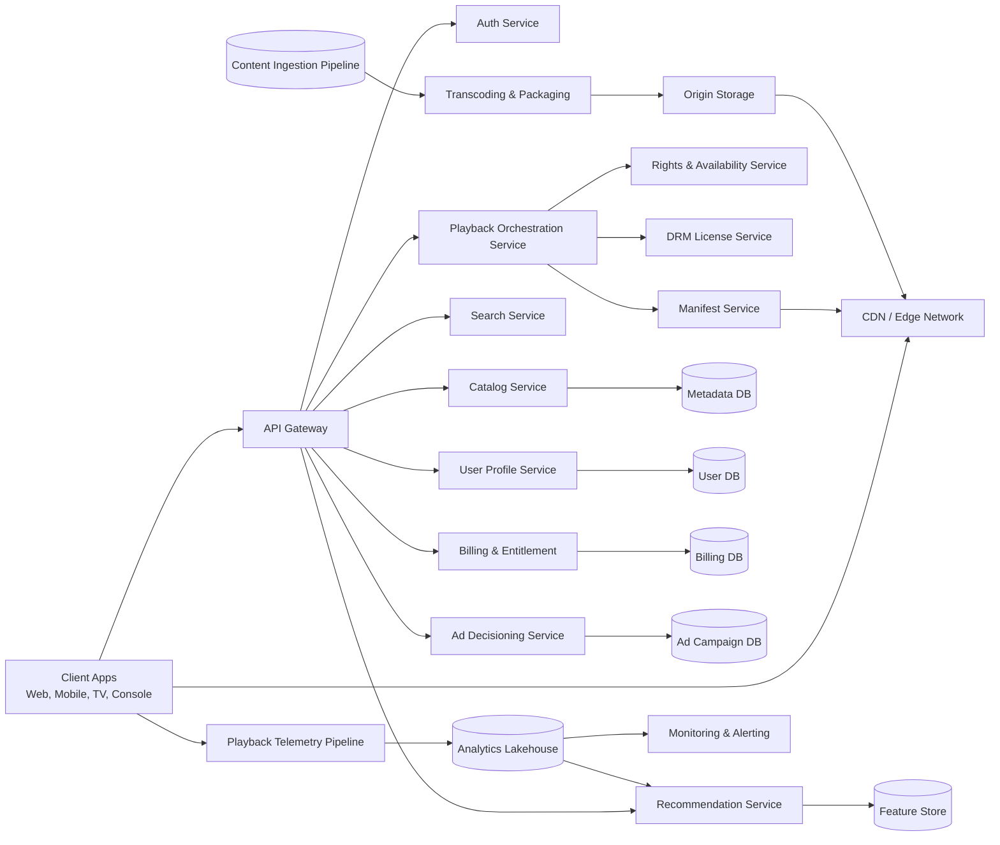
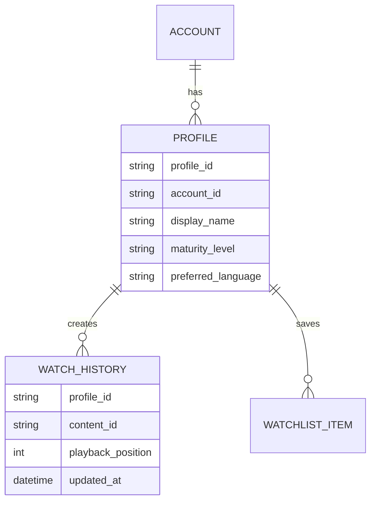
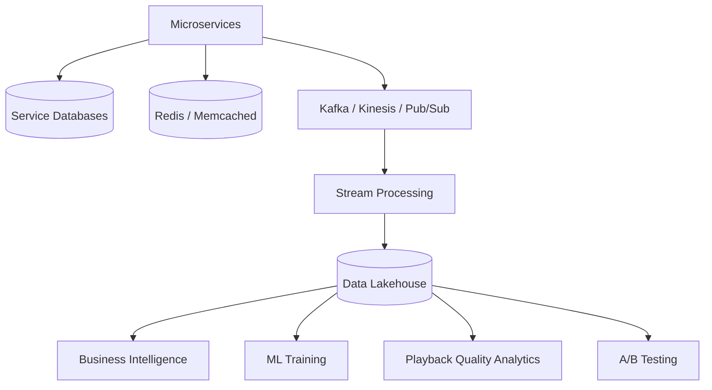

# EmuTV System Design Document
**Version 1.0**

**Audience:** Developers, Platform Teams, Product Managers, Technical Leadership

**Owner:** Hector Adama

*NOTE: EmuTV is a fictional streaming platform used as an example for this document. As this is a sample, it is not exhaustive and has been kept condensed for length, so some sections may appear to be missing steps.*

## 1. Overview
EmuTV is a subscription-based and ad-supported video streaming platform. It supports on-demand video, live events, personalised recommendations, user profiles, subscription tiers, targeted advertising, parental controls, downloads, and cross-device playback.

The platform must support:

 - Tens of millions of registered and paid users
 - Millions of active users daily
 - Large traffic spikes during live sports, premieres, and breaking news events
 - Low-latency playback startup
 - High availability across web, mobile, smart TVs, game consoles, and set-top boxes
 - Personalised discovery and recommendations
 - Ad-supported and ad-free subscription models
 - Secure content delivery with Digital Rights Management (DRM)
 - Scalable ingestion for movies, series, clips, live steams, and promotional assets

## 2. Goals and Non-Goals
### 2.1 Goals
The EmuTV platform should:

 - Deliver high-quality adaptive video playback to a global audience
 - Support both video-on-demand (VOD) and live streaming content
 - Scale during major events without service degradation
 - Provide personalised content discovery
 - Support advertising, subscriptions, billing, entitlements, and promotions
 - Protect licensed content through DRM, signed URLs, and anti-piracy controls
 - Provide observability for playback quality, errors, latency, and business metrics

### 2.2 Non-Goals
This system design does not cover:

 - Full creative production workflows
 - Detailed studio rights negotiations
 - Low-level codec implementation
 - Hardware-specific app implementation details

## 3. High-Level Architecture


## 4. Core Components
### 4.1 Client Applications
Supported platforms include:

 - Web browsers
 - Mobile devices (iOS and Android)
 - Roku, Fire TV, Apple TV, Android TV
 - Smart TVs
 - Game consoles
 - Set-top boxes

Responsibilities:

 - Authenticate users
 - Browse content catalog
 - Request playback sessions
 - Display ads where applicable
 - Handle adaptive bitrate playback
 - Send quality-of-experience telemetry
 - Enforce profile, parental control, and download rules

### 4.2 API Gateway
The API Gateway is the single point of entry for client requests.

Responsibilities:

 - Request routing
 - Authentication validation
 - Rate limiting
 - Device identification
 - API versioning
 - Request logging
 - Bot and abuse protection
 - Regional routing

Possible technologies:

 - Kong
 - AWS API Gateway
 - Envoy
 - NGINX
 - Apigee

### 4.3 Identity and Authentication Service
Responsibilities:

 - User registration
 - Login and logout
 - OAuth/OIDC token issuance
 - Password reset
 - Multi-factor authentication
 - Device registration
 - Session management
 - Fraud detection signals

Data model examples:
```
User
- user_id
- email
- password_hash
- account_status
- created_at
- last_login_at

Device
- device_id
- user_id
- platform
- app_version
- registered_at
- last_seen_at 
```

### 4.4 User Profile Service
Users may have multiple viewing profiles per account.

Responsibilities:

 - Profile creation
 - Watch history
 - Continue watching
 - Parental control settings
 - Language preferences
 - Subtitle preferences
 - Personalised home rows



## 5. Data Architecture


Storage choices:

|Data Type|Suggested Store|
|--|--|
|User accounts|Relational DB|
|Profiles/watch history|NoSQL + cache|
|Catalog metadata|Relational DB + search index|
|Video assets|Object storage|
|Search index|OpenSearch/Elasticsearch|
|Playback events|Kafka + data lake|
|Recommendations|Feature store + low-latency serving DB|
|Billing records|Strongly consistent relational DB|
|Entitlements|Relational DB + cache|
|Session state|Redis or distributed key-value store|

## 6. Scalability Strategy
### 6.1 CDN Delivery
Video traffic should not be served directly from core application servers. Instead, all video segments should be distributed through Content Delivery Network (CDN) edge locations. Multi-CDN support is recommended for resilience.

Benefits:

 - Reduces origin load
 - Improves playback latency
 - Supports global scale
 - Handles burst traffic efficiently

### 6.2 Horizontal Service Scaling
Stateless services should scale horizontally behind load balancers because any instance can fulfill any user request. This approach allows traffic to be seamlessly distrubuted and instances to be added or removed on demand without breaking user experiences.

Examples:

 - API Gateway
 - Catalog API
 - Playback API

Scaling stateful systems involves decoupling the state from application instances or distributing the state across a cluster. The goal is to move from a tightly coupled architecture to one that allows traffic to be seamlessly distributed without losing context data.

To accomplish this, stateful systems should use:

 - Sharding
 - Read replicas
 - Partitioning
 - Caching
 - Eventual consistency where acceptable

## 7. Reliability and Availability
Reliability means ensuring the platform architecture performs its intended functions correctly and consistently despite stress, network outages, or hardware failures. How reliable a system is depends on two core areas:

 - **Fault tolerance:** the ability to keep working when something goes wrong
 - **Recoverability:** how quickly the system comes back online after an issue.

Target service levels:
|Area|Target|
|--|--|
|Video segment delivery|99.99%|
|Playback authorisation|99.95%|
|Browse/catalog APIs|99.9%|
|Billing operations|99.9%|
|Live event playback|99.9% during scheduled events|

Reliability patterns:

 - Multi-region deployment
 - Multi-CDN routing
 - Circuit breakers
 - Graceful degradation
 - Read-only fallback modes
 - Queue-based retries
 - Dead-letter queues
 - Regional failover
 - Chaos testing before major events

Graceful degradation examples:

 - If recommendations fail, show trending content.
 - If search personalisation fails, show generic results.
 - If ad decisioning fails, use fallback ads or continue playback depending on business rules.
 - If watch history writes fail, buffer client events and retry.
 - If live chat or secondary features fail, preserve video playback first.

## 8. Example API Endpoints

```
GET /v1/catalog/home
GET /v1/catalog/titles/{content_id}
GET /v1/search?q={query}
POST /v1/playback/session
GET /v1/profiles/{profile_id}/watch-history
POST /v1/profiles/{profile_id}/watchlist
GET /v1/recommendations/home
POST /v1/billing/subscription
GET /v1/entitlements/{account_id}
```

Example playback request:

```
{
	"content_id": "movie_12345",
	"profile_id": "profile_9876",
	"device_id": "device_4567",
	"playback_mode": "stream",
	"drm": "widevine",
	"location": {
		"country": "US",
		"region": "CA"
	}
}
```

Example playback response:
```
{
	"session_id": "session_abc123",
	"manifest_url": "https://cdn.emutv.example/manifest.m3u8?token={token}",
	"drm_license_url": "https://drm.emutv.example/license",
	"expires_at": "2026-06-16T22:00:00Z",
	"ads": {
		"enabled": true,
		"ad_mode": "ssai"
	},
	"playback_policy": {
		"max_resolution": "4K",
		"downloads_allowed": false,
		"concurrent_streams_remaining": 2
	}
}
```

## 9. Incident Scenarios and Mitigations
To design a robust and efficient system, you must embrace the reality that failures will happen and plan according. You should design systems for graceful degradation and build robust observability to ensure anomalies are instantly detected. You should also implement automated failover mechanisms to minimise user impacts during outages.
|Scenario|Impact|Mitigation|
|--|--|--|
|CDN degradation|Buffering, playback failures|Multi-CDN failover|
|DRM outage|Users cannot start protected content|Region failover, cached license configs|
|Recommendation outage|Homepage experience degradation|Show editorial or trending rows|
|Billing provider outage|Subscription updates fail|Retry queue, temporary entitlement grace period|
|Live event traffic spike|API overload|Pre-scaling, waiting room, CDN pre-warming|
|Metadata publishing error|Wrong titles appear|Versioned catalog publishing, rollback|
|Ad decisioning latency|Playback startup delay|Timeout fallback, default ad state|

## 10. Recommended Internal Documentation Set
To operate EmuTV effectively, internal documentation should be treated as an integral part of the codebase, not an afterthought. It preserves the reasoning behind architectural and business decisions, streamlines developer onboarding, and eliminates architectural confusion. 

Teams should maintain:

 - Architecture overview
 - Service catalog
 - API reference
 - Playback troubleshooting guide
 - Live event readiness checklist
 - Incident response runbooks
 - Content ingestion guide
 - Metadata publishing guide
 - DRM integration guide
 - Ad platform integration guide
 - Data dictionary
 - Architecture decision records
 - New developer onboarding guide

## 11. Conclusion
EmuTV requires a CDN-first, event-driven, multi-service architecture optimised around playback reliability, metadata accuracy, entitlement correctness, and live event scalability. The most important design principle to consider is that video playback must remain reliable even when secondary systems degrade.

The platform can grow by improving live event readiness, personalisation, multi-CDN routing, encoding efficiency, internation support, and internal developer documentation. At scale, the system must be designed not only for normal daily usage, but also for rare periods of extreme traffic spikes caused by live sports, premieres, and cultural events.