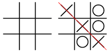

# How to Play Tic-Tac-Toe

## Overview

Tic-Tac-Toe (also known as Noughts and Crosses and Xs and Os) is a game for two players. Players take turns marking spaces in a three-by-three grid with either an X or an O. The simplicity of tic-tac-toe makes it great for teaching good sportsmanship or as a simple tool for testing the efficacy of artificial intelligence.

A winner is declared whenever one player places **three** of their marks in a *horizontal, vertical, or diagonal* row. Tic-Tac-Toe can be played using pen and paper or on a computer.

The following example from [Wikipedia](https://en.wikipedia.org/wiki/Tic-tac-toe) shows how Player One (X) wins the game in seven steps:

This document will teach you how to play a game of Tic-Tac-Toe using the **pen and paper** method.

# How to play

To play, you will need:

+ Two players
+ A sheet of paper large enough for a three-by-three grid
+ A pen or a pencil

There are a few basic rules to consider first. Each player may only draw one X or one O per turn. Each player may draw only either Xs or Os, never both. Finally, once a space contains an X or an O, it is considered unavailable for the rest of the game, and you cannot change the contents of a chosen space.

There is no universal agreement on who goes first, but for this document, you should assume that the player who goes first will play X. Tic-tac-toe is what’s known as a *futile game*, which means it is a game that always ends in a draw if both players play a perfect game. However, since not every player is aware of the optimal strategies, many more possible outcomes exist.

Once you have gathered the required materials, you can play by following these steps:

1. Begin by drawing a three-by-three grid on the paper.
2. Decide which player will go first.
3. Draw an X in one of the available spaces.
4. Now, it’s player two’s turn. Draw an O in one of the available spaces.
5. Continue taking turns until no empty spaces remain.

Did you win? Try playing again to see if you can change the outcome!